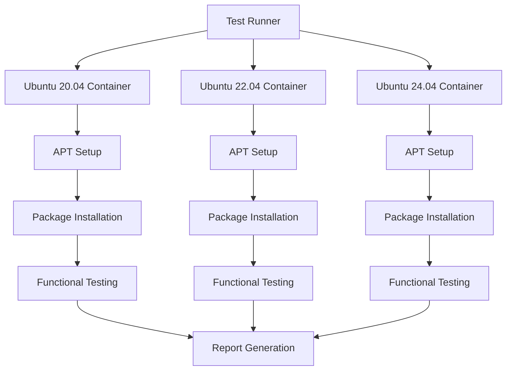

# APT Container Testing Guide

This guide provides comprehensive instructions for testing the rxiv-maker APT repository and Debian packages using containerized environments, with a focus on Podman for secure, rootless container execution.

## Overview

Container testing ensures that the APT repository and Debian packages work correctly in clean, isolated environments across different Ubuntu and Debian versions. This approach provides:

- **Clean Environment Testing**: Validates installation in fresh systems
- **Multi-Distribution Support**: Tests across Ubuntu 20.04, 22.04, and 24.04
- **Automated Validation**: Scripted testing reduces manual effort
- **Security**: Rootless containers with Podman provide enhanced security
- **Reproducibility**: Consistent testing environments

## Prerequisites

### Required Tools

**Podman Installation:**
```bash
# Ubuntu/Debian
sudo apt update && sudo apt install podman

# macOS
brew install podman
podman machine init
podman machine start

# Windows (via Podman Desktop)
# Download from: https://podman-desktop.io/
```

**Additional Tools:**
```bash
# Required for testing scripts
sudo apt install curl git jq

# Optional: For advanced container management
sudo apt install buildah skopeo
```

### Verify Podman Installation

```bash
# Test Podman functionality
podman --version
podman run --rm ubuntu:22.04 echo "Podman is working!"

# Check rootless configuration
podman info | grep -E "rootless|runRoot"
```

## Testing Architecture

### Container Test Strategy



### Test Phases

1. **Environment Setup**: Create clean container with Ubuntu base
2. **APT Repository Configuration**: Add rxiv-maker repository and GPG key
3. **Package Installation**: Install rxiv-maker via APT
4. **Dependency Verification**: Ensure all dependencies are correctly installed
5. **Functional Testing**: Test core rxiv-maker functionality
6. **Security Validation**: Verify package signatures and permissions
7. **Cleanup Testing**: Test package removal and cleanup

## Quick Start

### Basic Container Test

```bash
# Clone repository (if not already done)
git clone https://github.com/henriqueslab/rxiv-maker.git
cd rxiv-maker

# Run automated container test
./scripts/test-apt-container.sh --ubuntu-version 22.04

# Run comprehensive test across all versions
./scripts/run-container-tests.sh
```

### Manual Container Testing

```bash
# Start Ubuntu 22.04 container
podman run -it --name rxiv-test ubuntu:22.04 bash

# Inside container: Update package lists
apt update

# Add rxiv-maker repository
curl -fsSL https://raw.githubusercontent.com/henriqueslab/rxiv-maker/apt-repo/pubkey.gpg | gpg --dearmor -o /usr/share/keyrings/rxiv-maker.gpg
echo "deb [arch=amd64] https://raw.githubusercontent.com/henriqueslab/rxiv-maker/apt-repo stable main" > /etc/apt/sources.list.d/rxiv-maker.list

# Install rxiv-maker
apt update && apt install -y rxiv-maker

# Test functionality
rxiv --version
rxiv check-installation

# Create test manuscript
rxiv init test-paper
cd test-paper
rxiv pdf
```

## Automated Testing Scripts

### test-apt-container.sh

Comprehensive automated testing script for APT package validation:

**Features:**
- Multi-Ubuntu version support (20.04, 22.04, 24.04)
- Complete installation workflow testing
- Functional command validation
- Security and permission checks
- Detailed logging and reporting

**Usage:**
```bash
# Test specific Ubuntu version
./scripts/test-apt-container.sh --ubuntu-version 22.04

# Test with custom repository branch
./scripts/test-apt-container.sh --ubuntu-version 22.04 --repo-branch main

# Verbose output with debugging
./scripts/test-apt-container.sh --ubuntu-version 22.04 --verbose --debug

# Test package upgrade scenario
./scripts/test-apt-container.sh --ubuntu-version 22.04 --test-upgrade

# Custom package version testing
./scripts/test-apt-container.sh --ubuntu-version 22.04 --package-version 1.5.10
```

### run-container-tests.sh

Multi-container test orchestration script:

**Features:**
- Parallel testing across multiple Ubuntu versions
- Test result aggregation and reporting
- Failed test retry mechanism
- Comprehensive HTML test reports
- CI/CD integration support

**Usage:**
```bash
# Run all tests
./scripts/run-container-tests.sh

# Parallel execution with custom concurrency
./scripts/run-container-tests.sh --parallel 3

# Test specific versions only
./scripts/run-container-tests.sh --versions "20.04,22.04"

# Generate detailed report
./scripts/run-container-tests.sh --report-format html --output test-results/
```

## Container Test Environments

### Base Container Images

**Ubuntu 20.04 LTS (Focal):**
- Base: `ubuntu:20.04`
- Python: 3.8+
- APT: Standard Ubuntu repositories
- Use Case: Legacy system compatibility testing

**Ubuntu 22.04 LTS (Jammy):**
- Base: `ubuntu:22.04`
- Python: 3.10+
- APT: Modern package management
- Use Case: Current stable production testing

**Ubuntu 24.04 LTS (Noble):**
- Base: `ubuntu:24.04`
- Python: 3.12+
- APT: Latest package features
- Use Case: Future compatibility testing

### Custom Test Containerfiles

**Minimal Test Environment:**
```dockerfile
FROM ubuntu:22.04

# Install minimal dependencies
RUN apt-get update && apt-get install -y \
    curl \
    gnupg \
    ca-certificates \
    && rm -rf /var/lib/apt/lists/*

# Create test user
RUN useradd -m -s /bin/bash testuser
USER testuser
WORKDIR /home/testuser

# Copy test scripts
COPY scripts/test-apt-*.sh /usr/local/bin/
```

**Full Development Environment:**
```dockerfile
FROM ubuntu:22.04

# Install development tools
RUN apt-get update && apt-get install -y \
    build-essential \
    git \
    python3 \
    python3-pip \
    texlive-latex-base \
    && rm -rf /var/lib/apt/lists/*

# Setup test environment
USER testuser
WORKDIR /workspace
```

## Test Scenarios

### 1. Fresh Installation Testing

**Objective:** Validate clean installation from APT repository

**Steps:**
1. Start clean Ubuntu container
2. Add APT repository and GPG key
3. Update package lists
4. Install rxiv-maker package
5. Verify all dependencies installed correctly
6. Test basic functionality

**Validation:**
- Package installs without errors
- All required dependencies present
- Command-line tools accessible
- Basic operations functional

### 2. Upgrade Scenario Testing

**Objective:** Test package upgrades and version management

**Steps:**
1. Install older version of package
2. Add updated repository
3. Perform package upgrade
4. Verify upgrade completed successfully
5. Test functionality post-upgrade

**Validation:**
- Upgrade process completes without errors
- Configuration preserved during upgrade
- New features accessible
- No regression in existing functionality

### 3. Dependency Resolution Testing

**Objective:** Validate APT dependency handling

**Steps:**
1. Start container with minimal base
2. Install rxiv-maker (triggering dependency installation)
3. Verify all dependencies installed correctly
4. Test functionality requiring each dependency
5. Remove package and verify cleanup

**Validation:**
- All Python dependencies available
- LaTeX packages correctly installed
- System libraries accessible
- Clean removal without orphaned packages

### 4. Security Validation Testing

**Objective:** Ensure package security and integrity

**Steps:**
1. Verify GPG signature validation
2. Check package file permissions
3. Validate repository HTTPS access
4. Test user privilege requirements
5. Verify no privileged operations required

**Validation:**
- GPG signatures valid
- File permissions secure
- No root privileges required for normal operation
- Repository accessible via HTTPS

### 5. Functional Testing Suite

**Objective:** Validate core rxiv-maker functionality

**Test Cases:**
```bash
# Version and help
rxiv --version
rxiv --help

# Installation check
rxiv check-installation

# Manuscript operations
rxiv init test-manuscript
cd test-manuscript
rxiv validate .
rxiv pdf .

# Figure generation
rxiv figures .

# Cleanup operations
rxiv clean .
```

## Advanced Testing Features

### Performance Testing

**Installation Performance:**
```bash
# Measure installation time
time apt install rxiv-maker

# Monitor resource usage during installation
```

**Runtime Performance:**
```bash
# Benchmark core operations
time rxiv pdf test-manuscript

# Memory usage monitoring
/usr/bin/time -v rxiv pdf test-manuscript
```

### Security Testing

**GPG Verification:**
```bash
# Verify package signatures
apt-cache policy rxiv-maker
apt-key list

# Validate repository GPG key
gpg --verify /usr/share/keyrings/rxiv-maker.gpg
```

**Permission Validation:**
```bash
# Check installed file permissions
find /usr -name "*rxiv*" -ls

# Verify no setuid/setgid files
find /usr -name "*rxiv*" -perm /6000
```

### Multi-Architecture Testing

**AMD64 Testing:**
```bash
podman run --platform linux/amd64 -it ubuntu:22.04
```

**ARM64 Testing:**
```bash
podman run --platform linux/arm64 -it ubuntu:22.04
```

## CI/CD Integration

### GitHub Actions Integration

The container testing integrates with GitHub Actions for automated validation:

**Workflow Features:**
- Matrix testing across Ubuntu versions
- Parallel container execution
- Artifact collection and reporting
- Integration with release pipeline

**Trigger Conditions:**
- Pull requests affecting APT packaging
- Release candidate validation
- Scheduled weekly testing
- Manual workflow dispatch

### Local CI Simulation

```bash
# Run complete CI test suite locally
./scripts/run-container-tests.sh --ci-mode

# Generate CI-compatible reports
./scripts/run-container-tests.sh --format junit --output ci-results/
```

## Troubleshooting

### Common Issues

**Container Creation Failures:**
```bash
# Check Podman configuration
podman info

# Verify image availability
podman images
podman pull ubuntu:22.04

# Check storage space
df -h
```

**APT Repository Issues:**
```bash
# Verify repository accessibility
curl -I https://raw.githubusercontent.com/henriqueslab/rxiv-maker/apt-repo/dists/stable/Release

# Check GPG key import
apt-key list | grep -i rxiv

# Validate sources.list entry
cat /etc/apt/sources.list.d/rxiv-maker.list
```

**Package Installation Failures:**
```bash
# Check dependency resolution
apt-cache depends rxiv-maker

# Verify package availability
apt-cache search rxiv-maker

# Debug installation issues
apt install -y --dry-run rxiv-maker
```

### Debug Mode

**Enable Debug Output:**
```bash
# Container testing with debug
./scripts/test-apt-container.sh --debug --verbose

# APT debug mode
apt install -o Debug::pkgAcquire::Worker=1 rxiv-maker
```

**Log Collection:**
```bash
# Container logs
podman logs <container-id>

# APT logs
/var/log/apt/history.log
/var/log/apt/term.log
```

## Best Practices

### Container Management

1. **Use Rootless Containers**: Leverage Podman's rootless mode for security
2. **Clean After Testing**: Remove test containers to save space
3. **Version Pinning**: Use specific Ubuntu tags for reproducibility
4. **Resource Limits**: Set memory/CPU limits for consistent testing

### Test Design

1. **Isolated Tests**: Each test should be independent
2. **Comprehensive Coverage**: Test happy path and edge cases
3. **Clear Assertions**: Each test should have clear pass/fail criteria
4. **Automated Cleanup**: Tests should clean up after themselves

### Security Considerations

1. **No Privileged Containers**: Avoid --privileged flag
2. **Limited Network Access**: Use minimal network permissions
3. **Temporary Storage**: Use tmpfs for sensitive test data
4. **Key Management**: Handle GPG keys securely

## Integration with Development Workflow

### Pre-Release Testing

```bash
# Test release candidate packages
./scripts/test-apt-container.sh --package-version 1.6.0-rc1

# Validate upgrade path
./scripts/test-apt-container.sh --test-upgrade-from 1.5.10
```

### Continuous Monitoring

```bash
# Weekly repository health check
./scripts/validate-apt-repo.sh --comprehensive

# Automated regression testing
./scripts/run-container-tests.sh --regression-suite
```

### Developer Testing

```bash
# Quick development package test
./scripts/test-apt-container.sh --quick --ubuntu-version 22.04

# Local package testing
./scripts/test-apt-container.sh --local-package dist/rxiv-maker_*.deb
```

## Resources

### Container Documentation
- [Podman Official Documentation](https://docs.podman.io/)
- [Ubuntu Container Images](https://hub.docker.com/_/ubuntu)
- [Containerfile Best Practices](https://docs.podman.io/en/latest/markdown/podman-build.1.html)

### APT Testing Resources
- [Debian Package Testing](https://www.debian.org/doc/manuals/developers-reference/pkgs.html#testing-the-package)
- [APT Repository Management](https://wiki.debian.org/DebianRepository)
- [Package Validation Tools](https://lintian.debian.org/)

### Security Best Practices
- [Rootless Containers Security](https://docs.podman.io/en/latest/markdown/podman.1.html#rootless-mode)
- [Container Security Scanning](https://github.com/quay/clair)
- [GPG Package Signing](https://wiki.debian.org/SecureApt)

---

This comprehensive container testing framework ensures reliable, secure, and efficient validation of the rxiv-maker APT repository across multiple Ubuntu distributions.