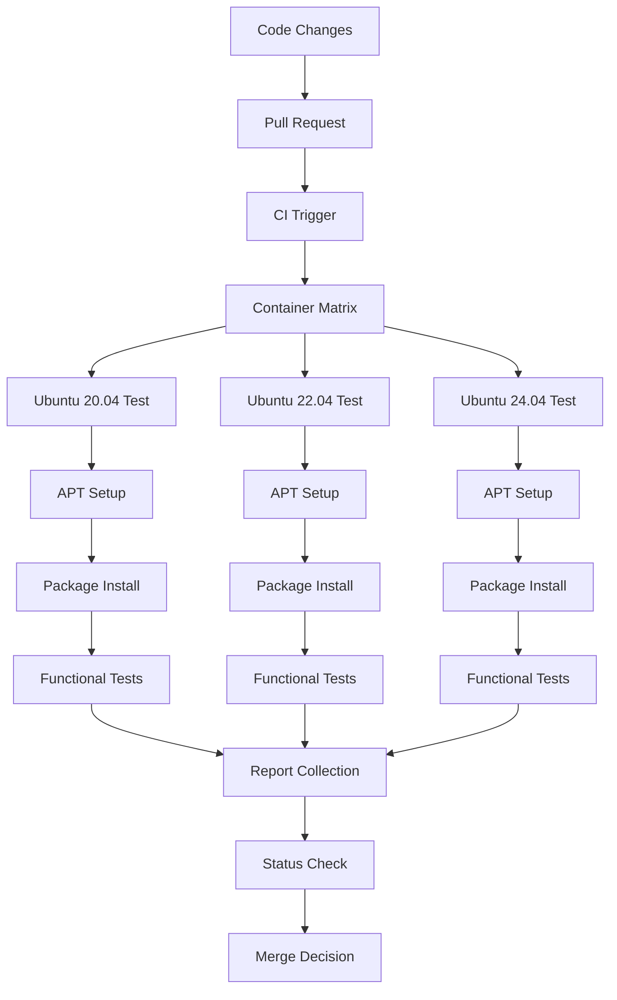

# Container APT Testing Workflow

This document describes the integration of container-based testing for the rxiv-maker APT repository within CI/CD pipelines and development workflows. The container testing ensures package quality, installation reliability, and cross-distribution compatibility.

## Overview

Container APT testing provides automated validation of Debian packages and APT repository functionality across multiple Ubuntu and Debian distributions. This approach ensures:

- **Distribution Compatibility**: Testing across Ubuntu 20.04, 22.04, and 24.04
- **Clean Environment Validation**: Installation testing in pristine containers
- **Automated Quality Assurance**: Integrated with CI/CD pipelines
- **Security Validation**: GPG signature and package integrity verification
- **Performance Monitoring**: Installation and runtime performance tracking

## Workflow Architecture



## CI/CD Integration

### GitHub Actions Workflow

The container testing integrates with GitHub Actions through the `test-apt-containers.yml` workflow:

**Trigger Events:**
- Pull requests affecting APT packaging files
- Release candidate validation
- Scheduled weekly testing
- Manual workflow dispatch

**Matrix Strategy:**
```yaml
strategy:
  matrix:
    ubuntu-version: ['20.04', '22.04', '24.04']
    test-type: ['installation', 'upgrade', 'functionality']
    include:
      - ubuntu-version: '22.04'
        test-type: 'performance'
      - ubuntu-version: '22.04'
        test-type: 'security'
```

### Workflow Phases

#### 1. Environment Setup

**Container Preparation:**
```bash
# Pull Ubuntu base images
podman pull ubuntu:20.04
podman pull ubuntu:22.04
podman pull ubuntu:24.04

# Create test networks
podman network create apt-test-network
```

**Test Data Preparation:**
```bash
# Prepare test manuscripts
cp -r EXAMPLE_MANUSCRIPT test-data/
cp -r MANUSCRIPT test-data/

# Generate test configurations
scripts/generate-test-configs.sh
```

#### 2. APT Repository Testing

**Fresh Installation Testing:**
```bash
# Start clean container
podman run --name test-fresh-${UBUNTU_VERSION} \
  --network apt-test-network \
  -v $(pwd):/workspace \
  ubuntu:${UBUNTU_VERSION}

# Execute installation test
scripts/test-apt-container.sh \
  --ubuntu-version ${UBUNTU_VERSION} \
  --test-type fresh-install
```

**Upgrade Testing:**
```bash
# Test package upgrade scenarios
scripts/test-apt-container.sh \
  --ubuntu-version ${UBUNTU_VERSION} \
  --test-type upgrade \
  --from-version 1.5.9 \
  --to-version 1.5.10
```

**Security Testing:**
```bash
# Validate GPG signatures and security
scripts/test-apt-container.sh \
  --ubuntu-version ${UBUNTU_VERSION} \
  --test-type security \
  --verify-signatures
```

#### 3. Functional Validation

**Core Functionality Testing:**
```bash
# Test manuscript operations
podman exec test-container bash -c "
  cd /workspace/test-data
  rxiv init test-manuscript
  cd test-manuscript
  rxiv validate .
  rxiv pdf .
  rxiv clean .
"
```

**Figure Generation Testing:**
```bash
# Test figure generation capabilities
podman exec test-container bash -c "
  cd /workspace/test-data/EXAMPLE_MANUSCRIPT
  rxiv figures .
  ls -la FIGURES/
"
```

#### 4. Performance Monitoring

**Installation Performance:**
```bash
# Measure installation time and resources
time podman exec test-container apt install rxiv-maker

# Monitor resource usage
podman stats test-container --no-stream
```

**Runtime Performance:**
```bash
# Benchmark core operations
podman exec test-container bash -c "
  time rxiv pdf test-manuscript
  time rxiv figures test-manuscript
"
```

#### 5. Report Generation

**Test Results Collection:**
```bash
# Collect test outputs
podman cp test-container:/test-results ./results/${UBUNTU_VERSION}/

# Generate reports
scripts/generate-test-report.sh \
  --input ./results \
  --output ./reports \
  --format html
```

## Local Development Integration

### Pre-Commit Testing

**Quick Container Test:**
```bash
# Fast validation before commit
scripts/test-apt-container.sh --quick --ubuntu-version 22.04

# Full validation for major changes
scripts/run-container-tests.sh --comprehensive
```

### Development Workflow

```bash
# 1. Make changes to APT packaging
vim debian/control

# 2. Build test package
scripts/build-deb.sh --output dist/

# 3. Test in container
scripts/test-apt-container.sh \
  --local-package dist/rxiv-maker_*.deb \
  --ubuntu-version 22.04

# 4. Commit changes
git add debian/
git commit -m "Update APT package dependencies"

# 5. CI automatically runs full container test suite
```

## Container Test Types

### 1. Installation Tests

**Fresh Installation:**
- Start with clean Ubuntu container
- Add APT repository
- Install rxiv-maker package
- Verify all dependencies installed
- Test basic functionality

**Custom Package Installation:**
- Build local .deb package
- Install in clean container
- Validate installation
- Test functionality

### 2. Upgrade Tests

**Version Upgrade:**
- Install older version
- Add updated repository
- Upgrade to newer version
- Verify upgrade success
- Test new functionality

**Repository Migration:**
- Test migration from old repository structure
- Validate key updates
- Ensure smooth transition

### 3. Functionality Tests

**Core Operations:**
```bash
# Command validation
rxiv --version
rxiv --help
rxiv check-installation

# Manuscript operations
rxiv init test-paper
rxiv validate test-paper
rxiv pdf test-paper
rxiv clean test-paper

# Figure generation
rxiv figures test-paper

# Advanced features
rxiv track-changes test-paper v1.0.0
rxiv arxiv test-paper
```

**Integration Tests:**
```bash
# Test with different manuscript types
for manuscript in EXAMPLE_MANUSCRIPT MANUSCRIPT; do
  cd $manuscript
  rxiv pdf .
  test -f output/*.pdf || exit 1
  cd ..
done
```

### 4. Security Tests

**GPG Verification:**
```bash
# Verify repository signatures
apt-key list | grep -i rxiv
gpg --verify /usr/share/keyrings/rxiv-maker.gpg

# Validate package signatures
apt-cache policy rxiv-maker
```

**Permission Validation:**
```bash
# Check file permissions
find /usr -name "*rxiv*" -ls
find /usr -name "*rxiv*" -perm /6000  # No setuid/setgid

# Verify user operations
su - testuser -c "rxiv --version"
```

### 5. Performance Tests

**Installation Benchmarks:**
```bash
# Time package installation
time apt install rxiv-maker

# Measure download size
apt-cache show rxiv-maker | grep Size
```

**Runtime Benchmarks:**
```bash
# Benchmark core operations
time rxiv pdf EXAMPLE_MANUSCRIPT
time rxiv figures EXAMPLE_MANUSCRIPT

# Memory usage monitoring
/usr/bin/time -v rxiv pdf EXAMPLE_MANUSCRIPT
```

## Automated Test Execution

### Parallel Testing

**Multi-Container Execution:**
```bash
# Run tests in parallel across distributions
scripts/run-container-tests.sh \
  --parallel 3 \
  --versions "20.04,22.04,24.04" \
  --test-types "installation,functionality"
```

**Resource Management:**
```bash
# Configure resource limits
podman run --memory=2g --cpus=1.0 \
  --name test-container ubuntu:22.04

# Monitor resource usage
scripts/monitor-container-resources.sh
```

### Test Orchestration

**Sequential Test Phases:**
1. **Setup Phase**: Container creation and network setup
2. **Installation Phase**: Package installation and validation
3. **Testing Phase**: Functional and performance testing
4. **Cleanup Phase**: Result collection and container cleanup

**Error Handling:**
```bash
# Retry failed tests
scripts/retry-failed-tests.sh \
  --max-retries 3 \
  --test-results results/

# Collect debug information
scripts/collect-debug-info.sh \
  --container test-container \
  --output debug/
```

## Continuous Monitoring

### Health Checks

**Repository Health:**
```bash
# Validate repository accessibility
curl -I https://raw.githubusercontent.com/henriqueslab/rxiv-maker/apt-repo/dists/stable/Release

# Check package availability
scripts/validate-apt-repo.sh --check-packages

# Monitor repository performance
scripts/monitor-repo-performance.sh
```

**Package Quality:**
```bash
# Lintian package validation
lintian dist/rxiv-maker_*.deb

# Security scanning
scripts/scan-package-security.sh dist/rxiv-maker_*.deb
```

### Regression Detection

**Performance Regression:**
```bash
# Compare performance with baseline
scripts/performance-regression-test.sh \
  --baseline results/baseline \
  --current results/current

# Monitor installation time trends
scripts/track-installation-performance.sh
```

**Functionality Regression:**
```bash
# Compare test results
scripts/compare-test-results.sh \
  --previous results/previous \
  --current results/current

# Automated regression alerts
scripts/regression-alerting.sh
```

## Container Management

### Resource Optimization

**Container Cleanup:**
```bash
# Clean up test containers
podman container prune -f

# Remove unused images
podman image prune -f

# Clean build cache
podman system prune -f
```

**Storage Management:**
```bash
# Monitor storage usage
podman system df

# Optimize container layers
podman build --squash-all

# Use multi-stage builds
podman build -f Containerfile.optimized
```

### Security Considerations

**Rootless Execution:**
```bash
# Run containers as non-root
podman run --user 1000:1000 ubuntu:22.04

# Use security contexts
podman run --security-opt label=disable ubuntu:22.04
```

**Network Isolation:**
```bash
# Create isolated networks
podman network create --driver bridge test-network

# Restrict network access
podman run --network none ubuntu:22.04
```

## Integration with Other Tools

### IDE Integration

**VS Code Integration:**
```json
{
  "tasks": [
    {
      "label": "Test APT Package",
      "type": "shell",
      "command": "./scripts/test-apt-container.sh",
      "args": ["--ubuntu-version", "22.04"],
      "group": "test"
    }
  ]
}
```

**Pre-commit Hooks:**
```yaml
repos:
  - repo: local
    hooks:
      - id: apt-container-test
        name: APT Container Test
        entry: ./scripts/test-apt-container.sh --quick
        language: system
        files: 'debian/.*'
```

### Monitoring Integration

**Metrics Collection:**
```bash
# Collect test metrics
scripts/collect-test-metrics.sh \
  --output metrics.json \
  --format prometheus

# Integration with monitoring systems
curl -X POST http://monitoring:9091/metrics/job/apt-tests \
  --data-binary @metrics.json
```

**Alerting Integration:**
```bash
# Send alerts on test failures
scripts/send-test-alerts.sh \
  --webhook-url $SLACK_WEBHOOK \
  --test-results results/
```

## Best Practices

### Container Design

1. **Minimal Base Images**: Use official Ubuntu images
2. **Layer Optimization**: Minimize Docker layers
3. **Cache Utilization**: Leverage build caches
4. **Security First**: Run as non-root when possible

### Test Design

1. **Isolation**: Each test should be independent
2. **Reproducibility**: Tests should produce consistent results
3. **Comprehensive Coverage**: Test all critical paths
4. **Fast Feedback**: Optimize for quick execution

### Resource Management

1. **Parallel Execution**: Use available CPU cores effectively
2. **Memory Limits**: Set appropriate memory constraints
3. **Storage Cleanup**: Clean up after tests
4. **Network Efficiency**: Minimize network operations

### Maintenance

1. **Regular Updates**: Keep container images updated
2. **Security Scanning**: Scan for vulnerabilities
3. **Performance Monitoring**: Track test performance
4. **Documentation**: Keep documentation current

## Troubleshooting

### Common Issues

**Container Creation Failures:**
```bash
# Check Podman configuration
podman info | grep -E "store|root"

# Verify image availability
podman images | grep ubuntu

# Check disk space
df -h /var/lib/containers
```

**Test Execution Failures:**
```bash
# Check container logs
podman logs test-container

# Debug test scripts
bash -x scripts/test-apt-container.sh

# Validate test environment
scripts/validate-test-environment.sh
```

**Performance Issues:**
```bash
# Monitor resource usage
podman stats --all

# Check system resources
free -h
df -h

# Optimize container configuration
scripts/optimize-container-config.sh
```

## Future Enhancements

### Planned Improvements

1. **Multi-Architecture Testing**: Add ARM64 testing
2. **Extended Distribution Support**: Add Debian testing
3. **Performance Benchmarking**: Detailed performance tracking
4. **Security Scanning**: Automated vulnerability detection

### Integration Opportunities

1. **Package Validation**: Integration with Debian QA tools
2. **Performance Monitoring**: Integration with APM systems
3. **Security Scanning**: Integration with security scanners
4. **Reporting**: Enhanced reporting and visualization

---

This container APT testing workflow ensures reliable, secure, and efficient validation of the rxiv-maker APT repository across multiple Ubuntu distributions, providing confidence in package quality and installation reliability.